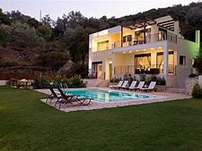

<html lang="en">
<head>
    <meta charset="UTF-8">
    <title>Title</title>
    <link rel="stylesheet" href="custom.css">
</head>
<body>
<ul>
    <li><a href="Index2.html">HOME PAGE</a></li>
    <li><a href="About2.html">ABOUT US</a></li>
    <li><a href="CONTACT.html">CONTACT US</a></li>
    <li><a href="extra.html">EXTRA INFO</a></li>
</ul>
<h1 style="color: deeppink;text-align: center">TRIVAGO VILLAS</h1>
<h2 style="color:hotpink;text-align: center">ARE YOU LOOKING FOR A HOME AWAY FROM HOME???</h2>
<h3 style="color:lightpink;text-align: center">LOOK NO FURTHER</h3>

We offer everything from cosy  
    one-bedroom hillside hideaways  
    to sprawling six-bedroomed villas  
    with enviable ocean views.All include  
    car hire which is perfect for reaching  
    and exporing your holiday retreat

<h4 style="text-align:center;color: black ">SOME VILLA COLLECTIONS</h4>
<body

<h3>For more information contact us through 0734545679</h3>
<h3>Or through our email <a href="trivagovil@gmail.com">trivagovil@gmail.com</a></h3>

Copyright & Copy;2019 Britney Moraa

</body>
</html>
<html lang="en">
<head>
    <meta charset="UTF-8">
    <title>Title</title>
    <link rel="stylesheet" href="BsFiles/css/bootstrap.css">
    <link rel="stylesheet" href="Urembo.css">
</head>
<body>
<ul>
    <li><a href="Index2.html">HOME PAGE</a></li>
    <li><a href="About2.html">ABOUT US</a></li>
    <li><a href="CONTACT.html">CONTACT US</a></li>
    <li><a href="extra.html">EXTRA INFO</a></li>
</ul>

    
    
    

        

            <nav class="navbar navbar-expand-md bg-danger">
                <!-- Brand -->
                <a class="navbar-brand" href="#">TRIVAGO</a>

                <!-- Toggler/collapsibe Button -->
                <button class="navbar-toggler" type="button" data-toggle="collapse" data-target="#collapsibleNavbar">
                    
                </button>

                <!-- Navbar links -->
                

                    <ul class="navbar-nav">
                        <li class="nav-item">
                            <a class="nav-link" href="#home">HOME</a>
                        </li>
                        <li class="nav-item">
                            <a class="nav-link" href="#gallery">GALLERY</a>
                        </li>
                        <li class="nav-item">
                            <a class="nav-link" href="#contact">CONTACT</a>
                        </li>
                    </ul>
                

                

                

            </nav>
            

                

                    <h1 class=".c">Welcome to Trivago villas </h1>
                    
 The best villas across the country 

                

            

            

                

                    <ul class="carousel-indicators">
                        <li data-target="#demo" data-slide-to="0" class="active"></li>
                        <li data-target="#demo" data-slide-to="1"></li>
                        <li data-target="#demo" data-slide-to="2"></li>
                    </ul>
                    

                        

                            
                            

                                <h3> Nakuru villa</h3>
                            

                        

                        

                            
                            

                                <h3>Nairobi villa</h3>
                            

                        

                        

                            
                            

                                <h3>Mombasa villa</h3>
                            

                        

                    

                    <a class="carousel-control-prev" href="#demo" data-slide="prev">
                        
                    </a>
                    <a class="carousel-control-next" href="#demo" data-slide="next">
                        
                    </a>
                

            

        

            <table class="table table-bordered ">
                <tr>
                    <th>LOCATION</th>
                    <th>PRICE/NIGHT</th>
                    <th>PAY</th>
                </tr>
                <tr>
                    <td>NAIROBI</td>
                    <td>$500</td>
                    <td><button class="btn btn-success">SELECT</button></td>
                </tr>
                <tr>
                    <td>NAKURU</td>
                    <td>$450</td>
                    <td><button class="btn btn-success">SELECT</button></td>
                </tr>
                <tr>
                    <td>MOMBASA</td>
                    <td>$570</td>
                    <td><button class="btn btn-success">SELECT</button></td>
                </tr>
            </table>

</body>
</html>
<html lang="en">
<head>
    <meta charset="UTF-8">
    <title>title</title>
    <link rel="stylesheet" href="Urembo.css">
    <link rel="stylesheet" href="BsFiles/css/bootstrap.css">
</head>
<body>

<ul>
    <li><a href="Index2.html">HOME PAGE</a></li>
       <li><a href="About2.html">ABOUT US</a></li>
    <li><a href="CONTACT.html">CONTACT US</a></li>
    <li><a href="extra.html">EXTRA INFO</a></li>
</ul>
<h2>Modal example</h2>
<!-- Button to Open the Modal-->
<button type="button" class="btn btn-primary" data-toggle="modal" data-target="#myModal">Form modal</button>
<!-- The Modal -->

    

        

            <!-- Modal Header -->
            

                <h4 class="modal-title">ModaL</h4>
                <button type="button" class="close" data-dismiss="modal">&times</button>
            

            <!-- Modal body -->
            

                <form>
                    <h1>FEEDBACK FORM</h1>
                    

                        

                            <label for="usr"> NAME:</label>
                            <input type="text" class="form-control " id="usr" name="username">

                        

                        

                            <label for="usr">EMAIL:</label>
                            <input type="email" class="form-control " id="usr" name="username">
                        

                        

                            <label for="usr">P.o.BOX:</label>
                            <input type="number" class="form-control" id="usr" name="number">
                        

                        

                            <label for="usr">COMMENT:</label>
                            <input type="text" class="form-control-plaintext" id="usr" name="comment">
                            <textarea name="Comment"placeholder="Please leave your comment here" id="" cols="30" rows="10"></textarea>
                        

                        <h3>RATE US</h3>
                        

                            <label class="form-check">
                                <input type="checkbox" class="form-check-input" name="optradio">EXCELLENT
                            </label>
                        

                        

                            <label class="form-check">
                                <input type="checkbox" class="form-check-input" name="optradio">GOOD
                            </label>
                        

                        

                            <label class="form-check">
                                <input type="checkbox" class="form-check-input" name=" optradio">AVERAGE
                            </label>
                        

                        

                            <label class="form-check">
                                <input type="checkbox" class="form-check-input" name=" optradio">BAD
                            </label>
                        

                    

                    

                        <label for="usr">File Upload</label>
                        <input type="file" class="form-control-file border">
                    

                    <button type="submit" class="btn btn-primary">SUBMIT</button>
                    <button type="reset" class="btn btn-success">RESET</button>
                </form>
            

        

    

</body>

</body>
</html>
